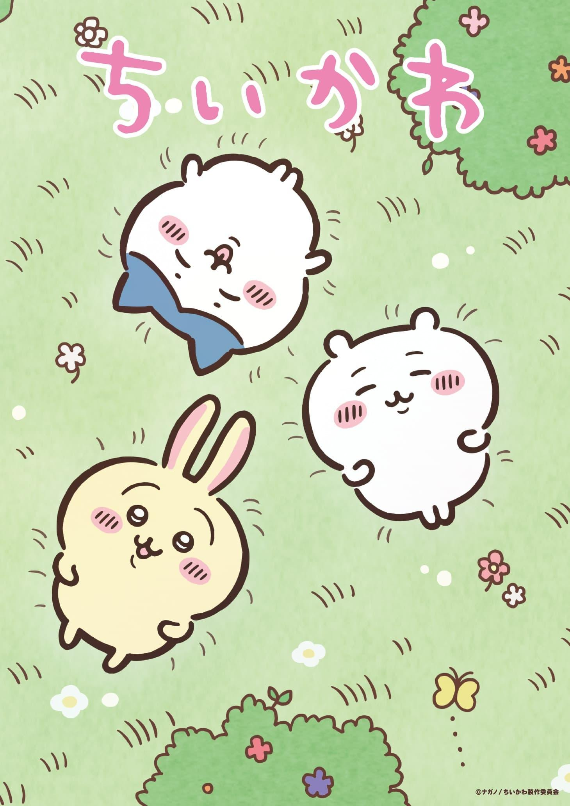
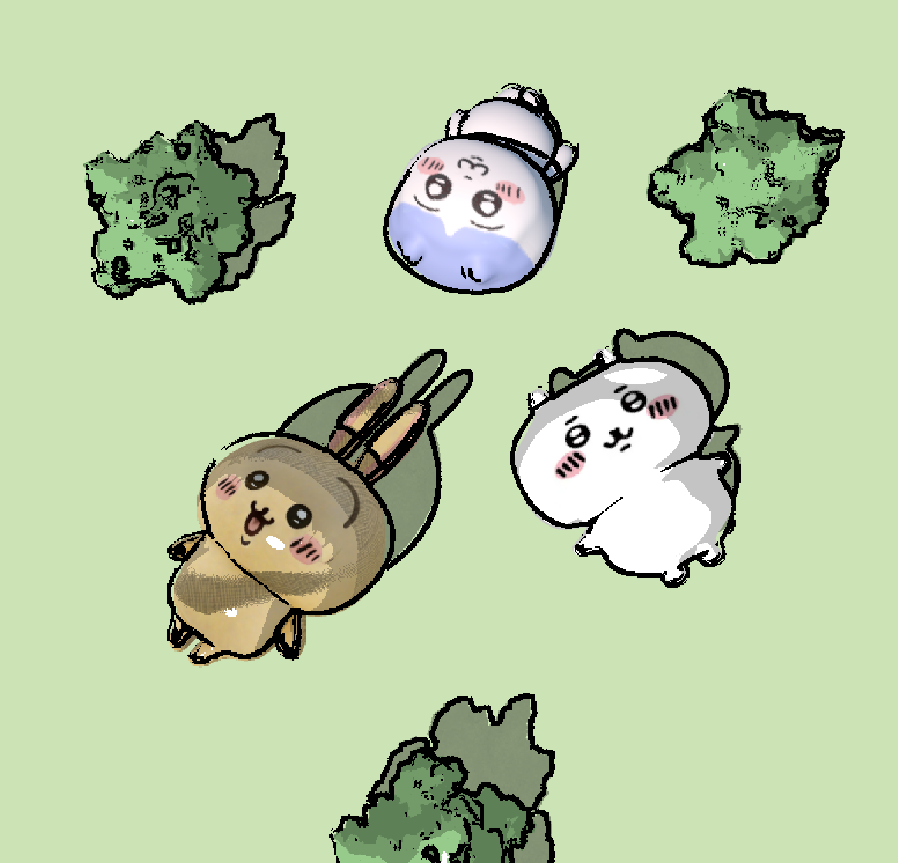
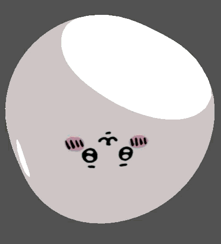
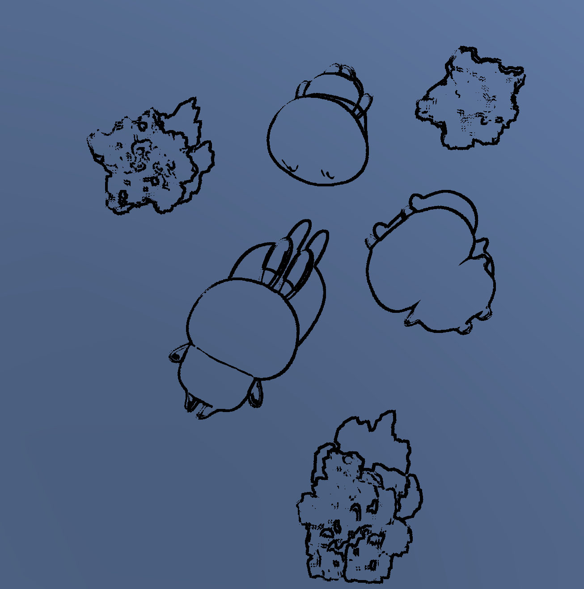

**University of Pennsylvania, CIS 5660: Procedural Graphics,
Homework 2**

* Bryce Joseph
* [Website](https://brycejo.com/), [LinkedIn](https://www.linkedin.com/in/brycejoseph/), [GitHub](https://github.com/brycej217)
* Tested on: Windows 11, Intel(R) CORE(TM) Ultra 9 275HX @ 2.70GHz 32.0GB, NVIDIA GeFORCE RTX 5080 Laptop GPU 16384MB

# CIS 5660 Homework 2: *3D Stylization*

# Overview

This project involved creating a stylized 3D scene in Unity based off a piece of 2D stylized artwork. As a big fan of the Chiikawa franchise (I've never watched an episode but I really like the characters), I decided to attempt to recreate a poster from the anime in Unity.

# Features

## Toon Shading

The project utilizes a 3-band toon shader in order to achieve its toonlike output. The shaders were implemented as HLSL shader programs within Unity (no shader graph), and utilized the provided lighting helper to achieve multiple lighting support. In addition, specular highlighting was added to give the scene more realistic lighting while still keeping the toon aesthetic. A crosshatch shadow texture was then used to add cartoonish shadow effects to the scene.

## Vertex Wobble

In addition, the toon shader was provided a vertex wobble effect within the toon shader, where the vertices of a model with the material are offset randomly along its vertex normal. On top of this, to achieve an choppy animated look, an FPS setting was added to have this offset only apply on FPS thresholds, i.e. providing a nice choppy animation look.

## Outlining

A fullscreen outlining effect was also added utilizing Unity URP render featuers. Effectively, a fullscreen pass renders normal data to a render target, which can then be read to determine where edges should be. In addition, a shadow mask was rendered to using a fullscreen pass, which was then read by the same outlining shader to give all shadows a distinct outline within the scene. Effectively, another render target (shadow target) was created, which stored which parts of the scene were in shadow. This render target was then fed as additional input to the outlining shader, which could then read this data and create an outline based on both normal and shadow information.

# Acknowledgements
I would like to thank the CIS 5660 staff for the base code and extensive tutorials as well as the following 3D artists for their models:

[Chiikawa](https://sketchfab.com/3d-models/chiikawa-7322ae143a3e425884c238923ebbe5de) by xingchenhuang218

[Usagi](https://sketchfab.com/3d-models/usagi-edeb7465e9894aa7b0d205216ffde45d) by Yato

[Hachiware](https://sketchfab.com/3d-models/hachiware-3-11be95db337742ec98ef3420b804cc73) by SunaraOn3d

[Cartoon Bush](https://sketchfab.com/3d-models/cartoon-tree-or-bush-foliage-200371b56e8f4c888cf6199a87f5f7ae) by adarose